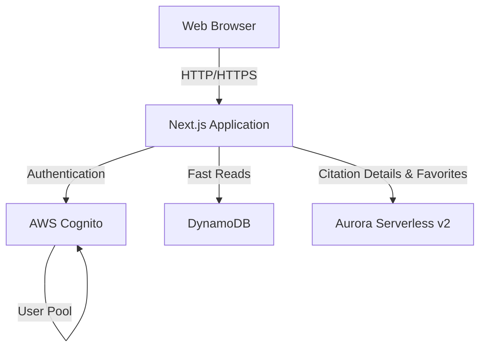

# Design Document

## Overview

The Citation Application is a Next.js web application that displays famous citations with different experiences for anonymous and authenticated users. The application leverages a dual-database architecture using DynamoDB for fast citation retrieval and Aurora Serverless v2 for relational data including user accounts, detailed citation information, and user favorites.

The architecture follows Next.js App Router conventions with server-side rendering for public pages and client-side interactivity for authenticated features. Authentication is handled using NextAuth.js with session management.

## Architecture

### High-Level Architecture



### Technology Stack

- **Frontend**: Next.js 14+ (App Router), React, TypeScript, Tailwind CSS
- **Authentication**: AWS Cognito for user management and authentication
- **Databases**: 
  - DynamoDB for citation metadata (fast reads, search)
  - Aurora Serverless v2 (PostgreSQL) for detailed citation information and user favorites
- **AWS SDK**: AWS SDK v3 for DynamoDB and Cognito operations
- **ORM**: Prisma for Aurora Serverless v2 interactions
- **Deployment**: Vercel or AWS Amplify

### Database Strategy

**DynamoDB Usage:**
- Primary use case: Fast citation listing and search
- Stores: Citation ID, quote text, author name, category, tags
- Access patterns: List all citations, search by author, search by keyword
- Benefits: Low latency, scalable reads

**Aurora Serverless v2 Usage:**
- Primary use case: Detailed citation data, user favorites, relationships
- Stores: Full citation details (biography, context, sources), user favorites (linked by Cognito user ID), citation relationships
- Access patterns: Detailed citation retrieval, favorites management
- Benefits: ACID compliance, complex queries, relational integrity

**AWS Cognito Usage:**
- Primary use case: User authentication and management
- Stores: User accounts, credentials, user attributes, roles
- Access patterns: User registration, login, session management, role-based access
- Benefits: Managed authentication, OAuth/OIDC support, MFA capabilities, secure credential storage

## Components and Interfaces

### Frontend Components

#### Page Components
- `app/page.tsx` - Public homepage displaying citation cards
- `app/login/page.tsx` - Login page with authentication form
- `app/citations/[id]/page.tsx` - Detailed citation page (authenticated)
- `app/favorites/page.tsx` - User favorites page (authenticated)
- `app/admin/page.tsx` - Admin panel for adding citations (authenticated, admin role)

#### UI Components
- `components/CitationCard.tsx` - Displays citation as a card with quote and author
- `components/CitationGrid.tsx` - Responsive grid layout for citation cards
- `components/SearchBar.tsx` - Search input with real-time filtering
- `components/FavoriteButton.tsx` - Toggle button for favoriting citations
- `components/LoginForm.tsx` - Email/password login form
- `components/AdminCitationForm.tsx` - Form for adding new citations

### Backend Components

#### API Routes
- `app/api/auth/login/route.ts` - Login endpoint (integrates with Cognito)
- `app/api/auth/logout/route.ts` - Logout endpoint
- `app/api/auth/register/route.ts` - User registration endpoint
- `app/api/citations/route.ts` - GET citations from DynamoDB, POST new citations
- `app/api/citations/[id]/route.ts` - GET detailed citation from Aurora
- `app/api/favorites/route.ts` - GET user favorites, POST/DELETE favorite
- `app/api/search/route.ts` - Search citations in DynamoDB

#### Service Layer
- `lib/services/citationService.ts` - Business logic for citation operations
- `lib/services/authService.ts` - Cognito authentication operations
- `lib/services/favoriteService.ts` - Favorites management

#### Data Access Layer
- `lib/db/dynamodb.ts` - DynamoDB client and operations
- `lib/db/prisma.ts` - Prisma client for Aurora Serverless v2
- `lib/db/cognito.ts` - Cognito client and operations
- `lib/db/queries/citations.ts` - Citation query functions
- `lib/db/queries/favorites.ts` - Favorites query functions

#### Authentication
- `lib/auth/cognito.ts` - Cognito configuration and helper functions
- `lib/auth/session.ts` - Session management with JWT tokens
- `lib/auth/middleware.ts` - Route protection middleware

## Data Models

### DynamoDB Schema

**Citations Table**
```typescript
{
  PK: string;              // "CITATION#<uuid>"
  SK: string;              // "METADATA"
  id: string;              // UUID
  quoteText: string;       // The citation text
  authorName: string;      // Author's name
  category: string;        // Category (e.g., "Motivation", "Philosophy")
  tags: string[];          // Searchable tags
  createdAt: string;       // ISO timestamp
  GSI1PK: string;          // "AUTHOR#<authorName>" for author search
  GSI1SK: string;          // createdAt for sorting
}
```

**Global Secondary Indexes:**
- GSI1: GSI1PK (HASH) + GSI1SK (RANGE) - For author-based queries

### Aurora Serverless v2 Schema (Prisma)

```prisma
model Citation {
  id                String    @id @default(uuid())
  quoteText         String
  authorName        String
  authorBiography   String?
  historicalContext String?
  source            String?
  category          String
  tags              String[]
  createdAt         DateTime  @default(now())
  updatedAt         DateTime  @updatedAt
  favorites         Favorite[]
  relatedCitations  CitationRelation[] @relation("FromCitation")
  relatedTo         CitationRelation[] @relation("ToCitation")
}

model Favorite {
  id         String   @id @default(uuid())
  cognitoUserId String  // Cognito User Pool user ID (sub claim)
  citationId String
  createdAt  DateTime @default(now())
  citation   Citation @relation(fields: [citationId], references: [id], onDelete: Cascade)
  
  @@unique([cognitoUserId, citationId])
  @@index([cognitoUserId])
}

model CitationRelation {
  id             String   @id @default(uuid())
  fromCitationId String
  toCitationId   String
  relationType   String   // "similar", "contrasting", "by_same_author"
  fromCitation   Citation @relation("FromCitation", fields: [fromCitationId], references: [id], onDelete: Cascade)
  toCitation     Citation @relation("ToCitation", fields: [toCitationId], references: [id], onDelete: Cascade)
  
  @@unique([fromCitationId, toCitationId, relationType])
}
```

## Correctness Properties

*A property is a characteristic or behavior that should hold true across all valid executions of a system—essentially, a formal statement about what the system should do. Properties serve as the bridge between human-readable specifications and machine-verifiable correctness guarantees.*

### Property Reflection

After reviewing the prework analysis, several properties can be consolidated or are redundant:

- Properties 4.2 (save favorite) and 4.5 (unfavorite) can be combined into a single property about favorite state management
- Properties 5.3 and 5.4 (storing in DynamoDB vs Aurora) are implementation details that can be verified through a single dual-write property
- Properties 3.1 and 4.1 (displaying additional UI elements for authenticated users) are similar UI rendering properties that can be consolidated

### Core Properties

**Property 1: Citation card completeness**
*For any* citation, when rendered as a card, the card SHALL contain both the quote text and the author name.
**Validates: Requirements 1.2**

**Property 2: Authentication success creates session**
*For any* valid user credentials, when authentication succeeds, the system SHALL create a valid session and redirect to the authenticated homepage.
**Validates: Requirements 2.3**

**Property 3: Authentication failure preserves state**
*For any* invalid credentials, when authentication fails, the system SHALL display an error message and keep the user on the login page without creating a session.
**Validates: Requirements 2.4**

**Property 4: Logout terminates session**
*For any* authenticated user session, when the user logs out, the system SHALL terminate the session and redirect to the public homepage.
**Validates: Requirements 2.5**

**Property 5: Authenticated users see enhanced metadata**
*For any* citation card viewed by an authenticated user, the card SHALL display additional metadata including category, date added, and source.
**Validates: Requirements 3.1**

**Property 6: Citation detail page completeness**
*For any* citation, when viewed on the detail page, the page SHALL display the complete quote, author biography, historical context, and related citations.
**Validates: Requirements 3.4**

**Property 7: Citation detail navigation**
*For any* citation card clicked by an authenticated user, the system SHALL navigate to the detailed citation page for that specific citation.
**Validates: Requirements 3.2**

**Property 8: Favorite button presence**
*For any* citation card viewed by an authenticated user, the card SHALL display a favorite button.
**Validates: Requirements 4.1**

**Property 9: Favorite state persistence**
*For any* citation and authenticated user, when the user favorites the citation, the citation SHALL appear in the user's favorites list, and when unfavorited, it SHALL be removed from the list.
**Validates: Requirements 4.2, 4.5**

**Property 10: Favorite button state reflects status**
*For any* citation, when favorited by a user, the favorite button SHALL update its state to indicate the citation is saved.
**Validates: Requirements 4.3**

**Property 11: Favorites page displays all saved citations**
*For any* authenticated user, when accessing the favorites page, the page SHALL display all citations the user has favorited.
**Validates: Requirements 4.4**

**Property 12: Dual-database citation storage**
*For any* new citation submitted by an administrator, the citation SHALL be stored in both DynamoDB (with metadata) and Aurora Serverless v2 (with complete details).
**Validates: Requirements 5.2, 5.3, 5.4**

**Property 13: Citation creation confirmation**
*For any* valid citation submitted by an administrator, when successfully added, the system SHALL display a confirmation message and clear the form.
**Validates: Requirements 5.5**

**Property 14: Search results display as cards**
*For any* search query that returns results, the system SHALL display the matching citations as cards.
**Validates: Requirements 6.2**

**Property 15: Author search completeness**
*For any* author name search query, the system SHALL return all citations by that author.
**Validates: Requirements 6.3**

**Property 16: Keyword search accuracy**
*For any* keyword search query, the system SHALL return only citations containing the keyword in the quote text.
**Validates: Requirements 6.4**

## Error Handling

### Authentication Errors
- Invalid credentials: Return 401 with user-friendly error message
- Expired session: Redirect to login page with session expired message
- Cognito service errors: Return 503 with retry guidance
- Missing authentication: Return 401 for protected routes

### Database Errors
- DynamoDB throttling: Implement exponential backoff retry logic
- Aurora connection errors: Return 503 with appropriate error message
- Query timeouts: Return 504 with timeout message
- Constraint violations: Return 400 with specific validation error

### Validation Errors
- Empty citation fields: Return 400 with field-specific error messages
- Invalid search queries: Return 400 with query format guidance
- Duplicate favorites: Handle silently (idempotent operation)
- Missing required fields: Return 400 with list of missing fields

### Client-Side Error Handling
- Network errors: Display retry button with error message
- Loading states: Show skeleton loaders during data fetching
- Empty states: Display helpful messages when no data is available
- Form validation: Show inline validation errors before submission

## Testing Strategy

### Unit Testing
The application will use **Vitest** as the testing framework for unit tests. Unit tests will cover:

- Component rendering logic (Citation cards, forms, buttons)
- Service layer functions (citation operations, favorite management)
- Data access layer functions (DynamoDB queries, Prisma operations)
- Authentication helper functions (session validation, token parsing)
- Utility functions (data formatting, validation)

Example unit tests:
- Test that CitationCard component renders with correct props
- Test that favoriteService.addFavorite calls the correct database operations
- Test that search query builder constructs valid DynamoDB queries
- Test that authentication middleware correctly identifies protected routes

### Property-Based Testing
The application will use **fast-check** as the property-based testing library. Property-based tests will verify the correctness properties defined above by generating random inputs and verifying the properties hold across all test cases.

Each property-based test will:
- Run a minimum of 100 iterations
- Be tagged with a comment referencing the specific correctness property
- Use the format: `**Feature: aws-security-agent-demo, Property {number}: {property_text}**`

Example property-based tests:
- Generate random citations and verify cards always contain quote text and author name
- Generate random user credentials and verify authentication behavior is consistent
- Generate random favorite operations and verify state persistence
- Generate random search queries and verify result accuracy

### Integration Testing
Integration tests will verify:
- End-to-end user flows (login → browse → favorite → logout)
- Database interactions (DynamoDB + Aurora coordination)
- Cognito authentication flow
- API route handlers with real database connections

### Test Data Management
- Use separate test databases for DynamoDB and Aurora
- Seed test data before test runs
- Clean up test data after test completion
- Use Cognito test user pool for authentication tests

## Performance Considerations

### Caching Strategy
- Implement Next.js ISR (Incremental Static Regeneration) for public citation pages
- Cache DynamoDB query results with 5-minute TTL
- Use React Query for client-side caching of API responses
- Implement CDN caching for static assets

### Database Optimization
- Use DynamoDB GSI for efficient author searches
- Implement pagination for citation lists (20 items per page)
- Use Aurora read replicas for read-heavy operations
- Batch DynamoDB operations where possible

### Authentication Optimization
- Cache Cognito JWT tokens in HTTP-only cookies
- Implement token refresh logic before expiration
- Use Cognito hosted UI for OAuth flows (future enhancement)

## Security Considerations

### Authentication & Authorization
- Use Cognito User Pools for secure credential storage
- Implement JWT token validation on all protected routes
- Use HTTP-only cookies for token storage
- Implement CSRF protection for state-changing operations
- Validate user roles (USER vs ADMIN) for admin operations

### Data Protection
- Encrypt sensitive data at rest in Aurora
- Use IAM roles for AWS service access (no hardcoded credentials)
- Implement rate limiting on API endpoints
- Sanitize user inputs to prevent injection attacks
- Use parameterized queries for all database operations

### API Security
- Implement CORS policies for API routes
- Use HTTPS for all communications
- Validate and sanitize all input data
- Implement request size limits
- Add API rate limiting per user/IP

## Deployment Architecture

### Infrastructure Components
- **Next.js Application**: Deployed on Vercel or AWS Amplify
- **DynamoDB**: Provisioned with on-demand capacity
- **Aurora Serverless v2**: Configured with auto-scaling (0.5-2 ACUs)
- **Cognito User Pool**: Configured with password policies and MFA support
- **CloudFront**: CDN for static assets and API caching

### Environment Configuration
- Development: Local DynamoDB, local Aurora (Docker), test Cognito pool
- Staging: AWS resources with reduced capacity
- Production: Full AWS resources with auto-scaling enabled

### CI/CD Pipeline
- Automated testing on pull requests
- Database migrations via Prisma migrate
- Infrastructure as Code using AWS CDK or Terraform
- Automated deployment to staging on merge to main
- Manual approval for production deployment

## Future Enhancements

- Social authentication (Google, Facebook) via Cognito
- Citation sharing functionality
- User profiles with custom preferences
- Citation collections/playlists
- Advanced search with filters (date range, category)
- Citation of the day feature
- Email notifications for new citations
- Mobile application using React Native
- GraphQL API layer for flexible querying
